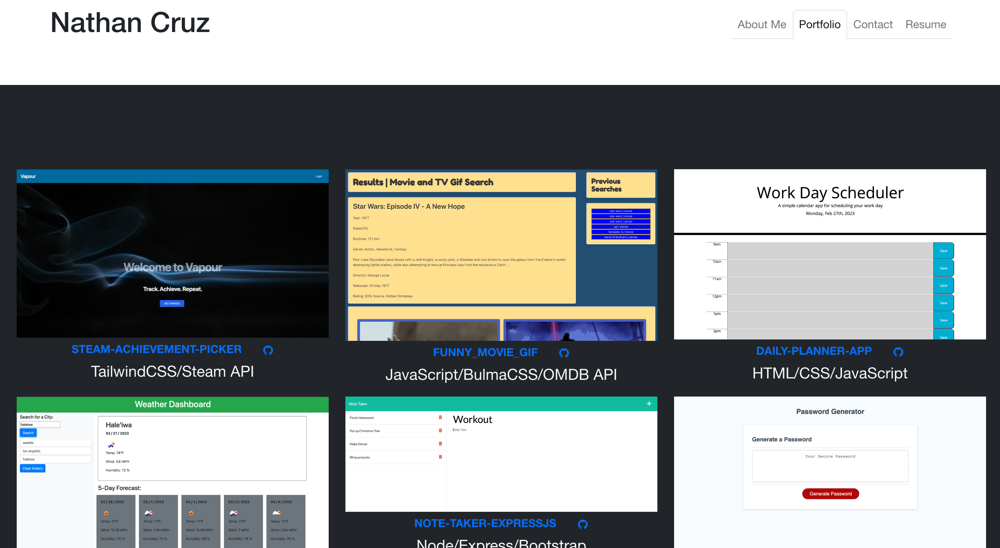

# React Portfolio

## Table of Contents
- [React Portfolio](#react-portfolio)
  - [Table of Contents](#table-of-contents)
  - [Description](#description)
  - [User Story](#user-story)
  - [Installation](#installation)
  - [Usage](#usage)
  - [Credits](#credits)
  - [License](#license)
  - [Contribution](#contribution)
  - [Tests](#tests)
  - [Questions](#questions)

## Description
This task was a challenge assigned to us where we create a new version of our portfolio using React. Every developer needs a place to share our projects while applying for jobs or working as a freelancer but also to share our work with other developers. We were not given any starter code.

This week was a little challenging getting everything to work as I had to completely start over because I was confusing myself with the components. I did enjoy taking on this task because it was front end focused and I got to play around with design even though I did not completely finish designing. I hope to come back to this to really make it the way I want and also figure out how to display the individual projects so when you hover over their screenshots, their information and links show.

## User Story

```
AS A future junior developer and bootcamp graduate
I WANT a portfolio that showcases my past projects 
SO THAT employers can have a better assessment of my technical skills and consider me as a candidate for any open positions
```

## Installation
N/A
## Usage

[Here is the link to my portfolio application.](https://crzn24.github.io/ncruz-react-portfolio/) <br>



## Credits
* [React Icons for Footer](https://react-icons.github.io/react-icons/)
* [Responsive Images](https://getbootstrap.com/docs/4.0/content/images/)
* [Target Blank](https://www.w3schools.com/tags/att_a_target.asp)
## License


## Contribution 


## Tests 
N/A

## Questions
Github: crzn24


